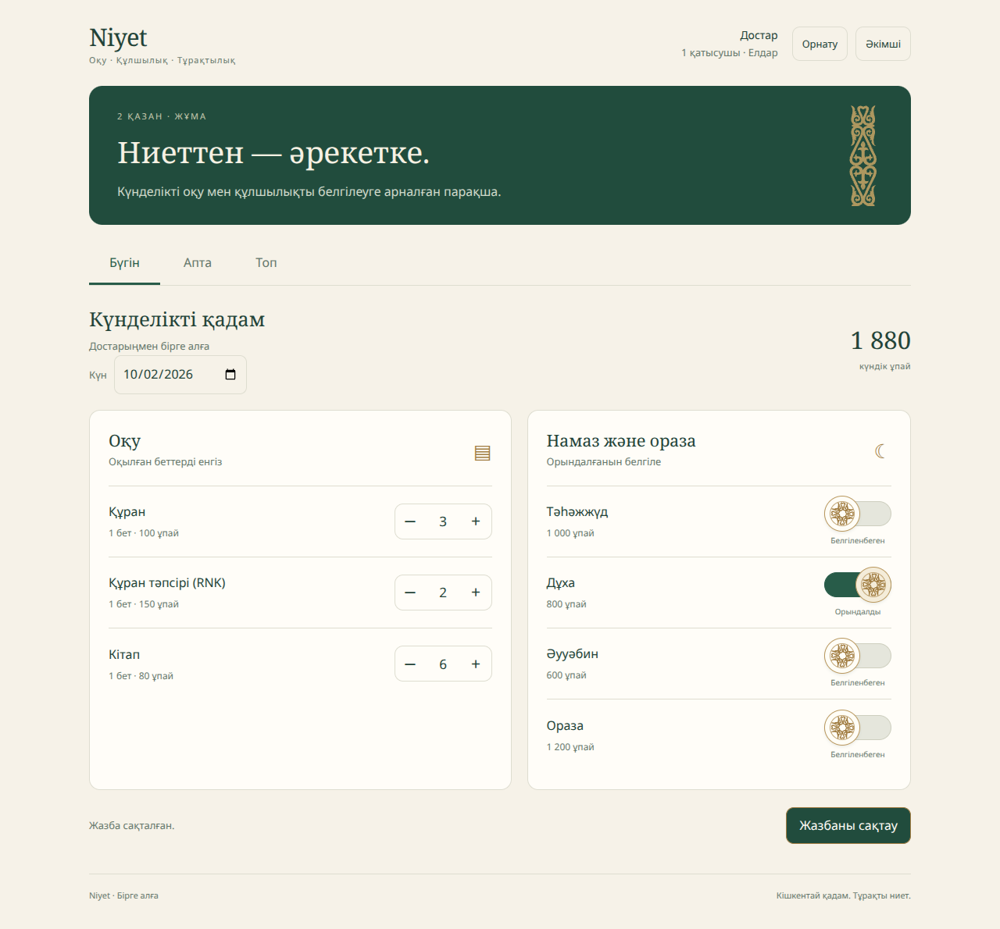

# Niyet

A Kazakh reading and prayer tracker for private groups. Emerald, warm paper and gold, with Kazakh ornament switches and a responsive mobile layout.



[Mobile preview](screenshots/mobile.png)

## Run locally

Requires Node.js 22 or newer.

```sh
npm install
npm run setup
npm run dev
```

Open http://localhost:3000. The local preview uses its local JSON adapter, so it works before Firebase is configured. Your generated admin PIN is in `.env.local`. Click **Әкімші**, enter the PIN, rename the two groups if needed, and create an invitation link for each. Open a link and enter a name to join. Local records live in `.data/state.json`; they are not committed.

```sh
npm test
npm run build
```

## Firebase setup

The production app uses Firebase Hosting, anonymous Firebase Authentication, Firestore, and a callable Cloud Function. The browser never reads or writes Firestore directly; the function checks membership, calculates points, and enforces admin actions.

1. In Firebase Console for project `niyet-e4d9`, enable **Authentication → Sign-in method → Anonymous** and create a **Cloud Firestore** database.
2. Open **Project settings → Your apps → Niyet web app → SDK setup and configuration**. Copy the full Firebase config object into `public/firebase-config.js`, keeping the existing `window.NIYET_FIREBASE_CONFIG =` wrapper. The app ID and project ID are already filled in; replace the API key with the value from your console. The web config is public client configuration, not a server secret.
3. Cloud Functions deployment requires the project to be on Firebase's Blaze plan (billing account attached). Set a budget alert in Google Cloud before first deployment if that helps you monitor usage.
4. Install Firebase CLI and sign in locally, then set the two server-only secrets. Use a unique 6–12 digit PIN and a long random invite-encryption secret; do not put either in Git:

   ```sh
   npm install
   npx firebase-tools login
   npx firebase-tools functions:secrets:set NIYET_ADMIN_PIN --project niyet-e4d9
   npx firebase-tools functions:secrets:set NIYET_INVITE_SECRET --project niyet-e4d9
   ```

   The CLI prompts for each secret value. For `NIYET_INVITE_SECRET`, use a randomly generated value of at least 48 characters. Then run `npm run deploy` once from your computer. This initializes the app, rules, and functions in Firebase.
5. For GitHub Actions deployment, create a Google Cloud service account for this project, grant it Firebase Hosting Admin (`roles/firebasehosting.admin`), Cloud Functions Admin (`roles/cloudfunctions.admin`), Service Account User (`roles/iam.serviceAccountUser`), Cloud Datastore Owner (`roles/datastore.owner`), and Firebase Rules Admin (`roles/firebaserules.admin`), create a JSON key, and add its full contents as the GitHub Actions repository secret `FIREBASE_DEPLOY_SERVICE_ACCOUNT`. Protect that key as you would a password. After this, every push to `main` runs tests and deploys Hosting, Functions, and Firestore rules. Pull requests run tests and build only; Firebase preview URLs would use the production backend.

Once deployed, open `/admin`, sign in with your PIN, create private invitation links, and send each link only to the intended group. Your first deployment starts with two empty groups; rename them in the admin page.

## Behavior

- **Бүгін:** enter pages and mark prayers/fasting; explicitly save. Saved entries can be edited during the current week through today.
- **Апта:** personal daily totals, pages, **Менің ұпайым**, and **Топтық ұпай** (sum of all group members' weekly scores).
- **Топ:** the only leaderboard. Equal scores share a rank. Weekly admin comments appear beside participants.
- The calendar uses Asia/Qyzylorda time. Weeks begin Monday.
- Admin manages both groups, regenerates links, adds activities, and schedules scoring rules for next Monday. Earned scores cannot be edited directly. Activities and scoring rules are shared across groups.
- Replacing an invitation invalidates the old link without removing current members.
- Firebase anonymous identity is kept in that browser. Clearing browser storage or changing devices means the person will need to join again; there is no account recovery in this first version.
- PWA: use **Орнату**, or the browser's Add to Home Screen / Install command. HTTPS is required outside localhost. The shell can be cached, but records need a live connection; offline writes are not queued.

## Data and security

Firestore rules deny all direct browser access. The server function scopes data by group membership, ignores client-supplied totals, rate-limits PIN and invite attempts, and keeps invite tokens encrypted at rest. Admin access expires after eight hours. Anyone holding an invitation can join that group: treat links as private. Firebase and Google Cloud usage is subject to the project's billing configuration.

## Assets

Noto Sans and Noto Serif are self-hosted; their font metadata contains their license and attribution. The ornament is adapted from the Kazakh ornamental band in `flag-icons` 7.5.0, under MIT; see `THIRD_PARTY_LICENSES.md`. No external analytics, images, fonts, or Sites plugin are used.
